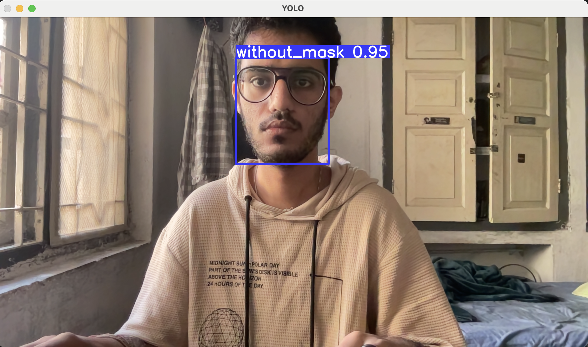
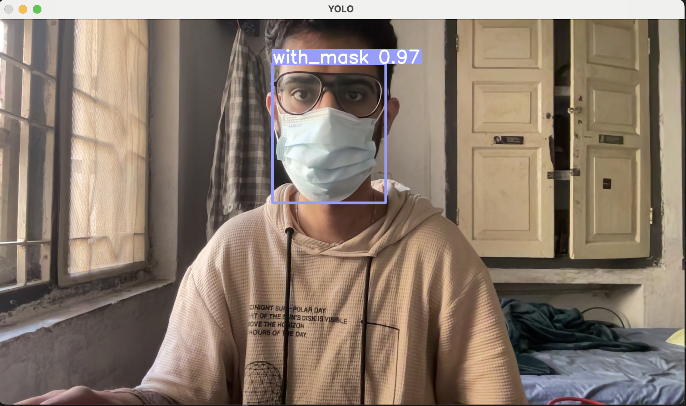
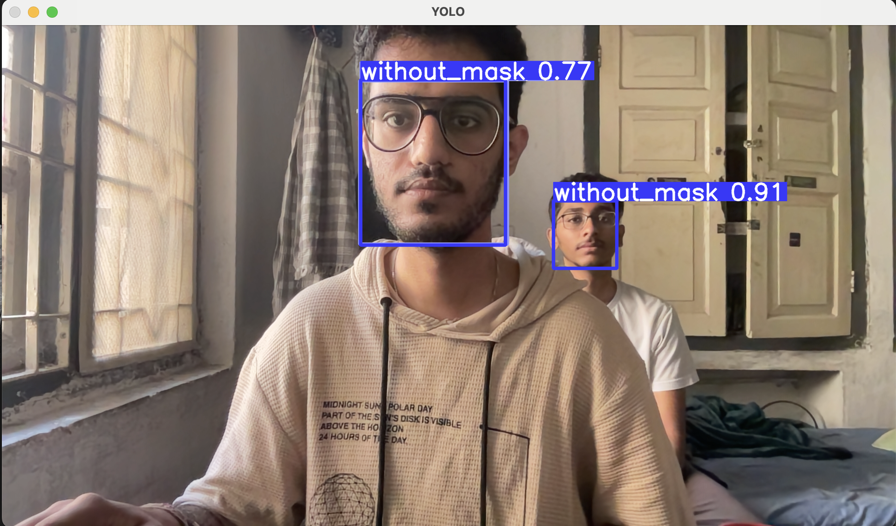

# Face Mask Detection

In the project, we have trained a yolov5 object detection model to detect whether a subject is wearing a mask or not.

## To run the project

Download the above repo and run the following cells in the jupyter notebook

1->2->3->4->5->7->8 (You can also run the cell between cell 7 and 8 to do real time face mask detection)

## Working project pics

without mask:-

with mask:-

with multiple people:-

